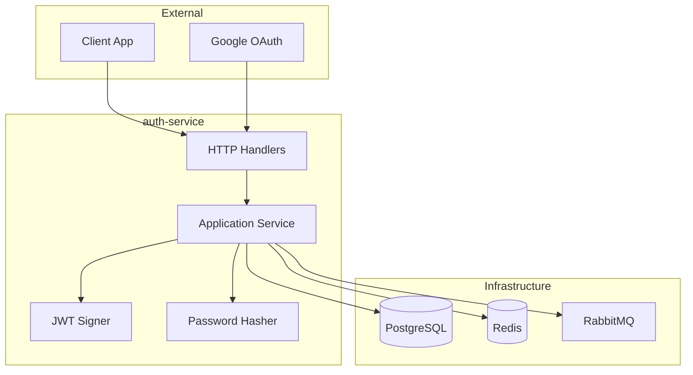

# Auth Service Architecture

## Overview

The **auth-service** is a dedicated authentication and authorization microservice responsible for user identity management, session control, and secure access token issuance. It follows a clean, hexagonal architecture with clearly defined ports and adapters.

## Responsibilities

- **User Registration & Login** (email/password)
- **OAuth 2.0 / OpenID Connect** (Google with PKCE)
- **JWT Access Token Issuance** (short-lived, stateless)
- **Refresh Token Management** (Redis-backed sessions)
- **Email Verification & Password Reset** (via async RabbitMQ events)
- **Role-Based Access Control** (user, moderator, admin)
- **Account Moderation** (ban/unban, lock/unlock)
- **Avatar Management** (profile images via media-service)

---

## Architecture Diagram



---

## Key Design Decisions & Tradeoffs

### 1. JWT for Access Tokens

**Decision**: Use short-lived JWTs (15-30 min) signed with HMAC-SHA256.

**Why JWT over alternatives?**

| Alternative | Tradeoff |
|------------|----------|
| **Session-only (cookie)** | Requires centralized session store lookup on every request; doesn't scale horizontally without sticky sessions |
| **OAuth2 opaque tokens** | Requires token introspection endpoint, adding latency; good for delegation but overkill for first-party auth |
| **JWT + RSA** | More secure key distribution but higher CPU cost; HMAC is sufficient for internal microservices with shared secret |

**Mitigation for JWT Statelessness**:
- `token_version` column in users table enables instant token invalidation
- Redis caches token versions to avoid DB hit on every request
- Refresh tokens are opaque and stored in Redis (revocable)

### 2. Refresh Token Rotation

**Decision**: Opaque refresh tokens stored in Redis with automatic rotation on each use.

**Why?**
- Prevents token replay attacks
- Redis TTL automatically expires stale sessions
- `RevokeAll(userID)` instantly logs out all devices

### 3. Password Hashing with bcrypt

**Decision**: bcrypt with cost factor 12.

| Alternative | Tradeoff |
|------------|----------|
| **Argon2id** | More memory-hard, better for offline attacks, but less library support in Go ecosystem |
| **scrypt** | Similar to Argon2 but less configurable |
| **PBKDF2** | NIST approved but weaker against GPU attacks |

bcrypt is chosen for its balance of security, simplicity, and widespread adoption.

### 4. OAuth with PKCE Flow

**Decision**: Implement Authorization Code flow with PKCE for Google OAuth.

**Why PKCE?**
- Prevents authorization code interception attacks
- Required for public clients (SPAs, mobile apps)
- Eliminates need for client secret in frontend

**State Management**: Redis-backed `OAuthStateStore` with TTL prevents CSRF attacks.

### 5. Async Email Delivery via RabbitMQ

**Decision**: Auth-service publishes events; email-service consumes and sends.

**Why not send emails directly?**
- Decouples auth logic from SMTP failures
- Enables retry, DLQ, and rate limiting in email-service
- Auth response is fast; email delivery is async

---

## Database Schema

### PostgreSQL Tables

```sql
CREATE TABLE users (
  id UUID PRIMARY KEY,
  email TEXT UNIQUE NOT NULL,
  password_hash TEXT NOT NULL,
  role TEXT CHECK (role IN ('user','moderator','admin')),
  email_verified BOOLEAN DEFAULT FALSE,
  locked BOOLEAN DEFAULT FALSE,
  token_version BIGINT DEFAULT 0,  -- For instant JWT invalidation
  avatar_image_id UUID,
  created_at TIMESTAMPTZ,
  updated_at TIMESTAMPTZ
);

CREATE TABLE oauth_identities (
  id UUID PRIMARY KEY,
  user_id UUID REFERENCES users(id),
  provider TEXT NOT NULL,          -- 'google', 'github', etc.
  provider_user_id TEXT NOT NULL,
  UNIQUE(provider, provider_user_id)
);

CREATE INDEX idx_users_role ON users(role);  -- Fast admin queries
```

### Database Optimization

1. **Index on email**: Unique constraint creates implicit index for login lookups
2. **Index on role**: For admin dashboard user filtering
3. **token_version for revocation**: Bump version to invalidate all JWTs for a user without touching token store
4. **Triggers for updated_at**: Automatic timestamp updates

---

## Redis Usage

| Key Pattern | Purpose | TTL |
|-------------|---------|-----|
| `refresh:{token}` | Maps refresh token → user_id | 7 days |
| `ott:{kind}:{token}` | One-time tokens (email verify, password reset) | 24h / 30m |
| `oauth_state:{nonce}` | OAuth flow CSRF protection | 10 min |
| `tv:{user_id}` | Token version cache | 5 min |
| `rl:{endpoint}:{key}` | Rate limiting counters | 1 min |

---

## RabbitMQ Integration

### Published Events

| Routing Key | Payload | Consumer |
|-------------|---------|----------|
| `email.verify` | `{user_id, email, url}` | email-service |
| `email.password_reset` | `{user_id, email, url}` | email-service |
| `media.avatar_updated` | `{user_id, old_avatar_id}` | media-worker (cleanup) |

**Pattern**: Auth-service never blocks on email delivery. Events are fire-and-forget with consumer-side acknowledgment.

---

## API Endpoints

### Public Routes
| Method | Path | Description |
|--------|------|-------------|
| POST | `/auth/v1/register` | Create new account |
| POST | `/auth/v1/login` | Email/password login |
| POST | `/auth/v1/refresh` | Rotate access token |
| POST | `/auth/v1/logout` | Revoke refresh token |
| GET | `/auth/v1/oauth/{provider}/start` | Begin OAuth flow |
| GET | `/auth/v1/oauth/{provider}/callback` | OAuth completion |

### Authenticated Routes
| Method | Path | Description |
|--------|------|-------------|
| GET | `/auth/v1/me` | Get current user |
| PATCH | `/auth/v1/me/avatar` | Update avatar |
| POST | `/auth/v1/password/change` | Change password |
| POST | `/auth/v1/sessions/revoke` | Revoke all sessions |

### Admin Routes
| Method | Path | Description |
|--------|------|-------------|
| POST | `/auth/v1/mod/users/{id}/ban` | Ban user |
| POST | `/auth/v1/admin/users/{id}/role` | Set user role |

---

## Testing Strategy

1. **Unit Tests**: Service methods with mocked ports (UserRepo, SessionStore, etc.)
2. **Integration Tests**: Real PostgreSQL + Redis in Docker
3. **Security Tests**: Token validation, CSRF protection, rate limiting
4. **OAuth Mock**: Fake OAuth provider for callback testing

---

## Security Considerations

- **HTTPS only** for all token transmission
- **HttpOnly cookies** for refresh tokens (prevents XSS)
- **CSRF token** required for cookie-based endpoints
- **Rate limiting** on login/register (10 req/min per IP)
- **Constant-time comparison** for password verification
- **Secure headers**: HSTS, X-Frame-Options, CSP

---

## Distributed Systems Guarantees

### Idempotency & No Double-Writes

| Operation | Guarantee | Mechanism |
|-----------|-----------|-----------|
| User registration | Exactly-once | Unique constraint on `email` |
| Token refresh | At-most-once | Atomic rotate in Redis (`MULTI/EXEC`) |
| Session revoke | Idempotent | `DEL` is naturally idempotent |

**Token Version Pattern**:
```
User requests JWT → Service signs with token_version=5
Admin revokes → Bump token_version to 6
Old JWT with version=5 → Rejected on validation
```

### Cache Consistency Strategy

| Data | Strategy | Why |
|------|----------|-----|
| Token version | Write-through | JWT must always validate against latest |
| Refresh tokens | Write-through | Session state must be consistent |
| Rate limit counters | TTL-based | Eventual consistency acceptable |

**No Cache Stampede**: Rate limit counters use `INCR` with `EX` to prevent thundering herd on expiry.

### Retry & Circuit Breaker Patterns

| Component | Failure Mode | Retry Strategy |
|-----------|--------------|----------------|
| PostgreSQL | Connection lost | pgx pool auto-reconnect, 3 retries |
| Redis | Connection lost | go-redis auto-reconnect, graceful fallback |
| RabbitMQ publish | Broker down | Fire-and-forget for non-critical (email), with fallback log |

### Horizontal Scaling & Statelessness

```yaml
# Kubernetes HPA
spec:
  minReplicas: 2
  maxReplicas: 10
  metrics:
    - type: Resource
      resource:
        name: cpu
        targetAverageUtilization: 70
```

**Why this service scales horizontally**:
- JWT validation is stateless (shared secret)
- Refresh tokens stored in Redis (shared state)
- No in-memory session state
- PostgreSQL handles concurrent writes via constraints

