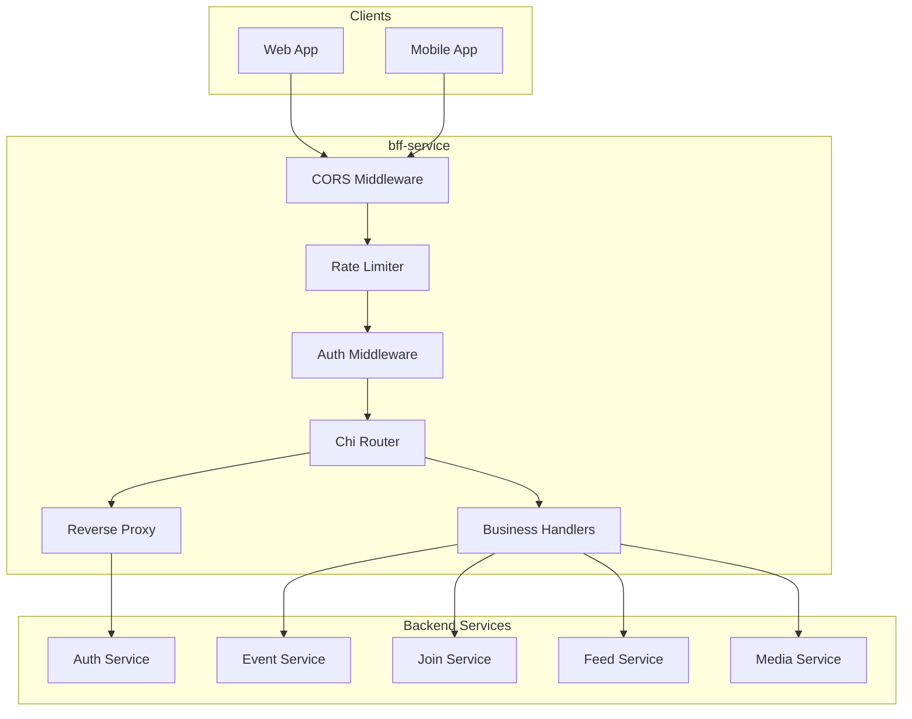

# BFF Service Architecture

## Overview

The **BFF (Backend-for-Frontend)** service is the API gateway layer that provides a unified entry point for all frontend clients. It handles authentication, request routing, rate limiting, and response aggregation.

## Responsibilities

- **API Gateway** (single entry point for all frontend requests)
- **Authentication Middleware** (JWT validation, context injection)
- **Request Proxying** (to auth, event, join, feed, media services)
- **Response Aggregation** (combine data from multiple services)
- **Rate Limiting** (per-user and per-IP limits)
- **CORS Handling** (cross-origin request management)
- **Request Tracing** (request ID propagation)

---

## Architecture Diagram



---

## Key Design Decisions & Tradeoffs

### 1. BFF Pattern vs Direct Service Access

**Decision**: All frontend requests go through BFF; no direct service access.

| Alternative | Tradeoff |
|-------------|----------|
| **Direct microservice calls** | Exposes internal APIs, complex client-side auth, CORS per service |
| **API Gateway (Kong, Envoy)** | Additional infrastructure, less flexibility for aggregation |
| **BFF per platform** | Overkill for current scale; one BFF serves web + potential mobile |

**Benefits**:
- Single CORS configuration
- Unified authentication layer
- Request/response transformation in one place

### 2. Hybrid Routing: Proxy vs Handler

**Decision**: Use reverse proxy for simple passthrough, handlers for aggregation.

| Route Type | Example | Implementation |
|------------|---------|----------------|
| **Proxy** | `/api/auth/*` | `httputil.ReverseProxy` |
| **Handler** | `/api/events/{id}/view` | Custom handler (combines event + organizer data) |

### 3. JWT Middleware Strategy

**Decision**: Validate JWT on every request; inject claims into context but don't block unauthenticated requests for public routes.

```go
// Middleware populates context if valid token present
ctx = context.WithValue(ctx, "user_id", claims.UserID)
ctx = context.WithValue(ctx, "role", claims.Role)
// Handlers check context for authorization
```

### 4. Distributed Rate Limiting

**Decision**: Redis-backed sliding window rate limiter for horizontal scaling.

| Fallback | Trigger |
|----------|---------|
| In-memory | Redis unavailable |

**Limits**:
- 100 requests/minute per authenticated user
- 200 requests/minute per IP (for anonymous)
- 10 requests/minute for login/register (stricter)

---

## Request Flow

1. **CORS**: Check origin, set headers
2. **Request ID**: Generate/extract `X-Request-ID`
3. **Metrics**: Record request start
4. **Rate Limit**: Check Redis counter
5. **Auth**: Parse JWT, populate context
6. **Route**: Match path to handler/proxy
7. **Execute**: Call downstream or aggregate
8. **Response**: Transform and return

---

## API Routes

### Proxied Routes (Passthrough)

| BFF Path | Upstream | Transform |
|----------|----------|-----------|
| `/api/auth/*` | auth-service `/auth/v1/*` | Strip `/api/auth`, add `/auth/v1` |
| `/api/feed/recommended` | feed-service `/api/feed` | Direct proxy |

### Business Handler Routes

| Method | Path | Description | Downstream Calls |
|--------|------|-------------|------------------|
| GET | `/api/events/{id}/view` | Event detail with organizer | event + auth |
| POST | `/api/events` | Create event | event-service |
| POST | `/api/events/{id}/join` | Join event | join-service |
| GET | `/api/me/joins` | User's registrations | join-service |
| POST | `/api/media/request-upload` | Get presigned URL | media-service |

---

## Downstream Client Configuration

```go
type Config struct {
    AuthServiceURL   string  // http://auth-service:8080
    EventServiceURL  string  // http://event-service:8080
    JoinServiceURL   string  // http://join-service:8080
    FeedServiceURL   string  // http://feed-service:8084
    MediaServiceURL  string  // http://media-service:8085
}
```

---

## Observability

- **Request ID propagation**: `X-Request-ID` passed to all downstream calls
- **Prometheus metrics**: Request count, latency histogram, error rate
- **OpenTelemetry tracing**: Optional distributed tracing (Jaeger/Tempo)
- **Structured logging**: JSON format with request_id correlation

---

## Security

- **CORS**: Whitelist frontend origins
- **Security headers**: HSTS, X-Frame-Options, CSP, X-Content-Type-Options
- **Rate limiting**: Prevent brute-force and DDoS
- **Input validation**: Sanitize before forwarding
- **Internal secret**: Authenticate service-to-service calls when needed
