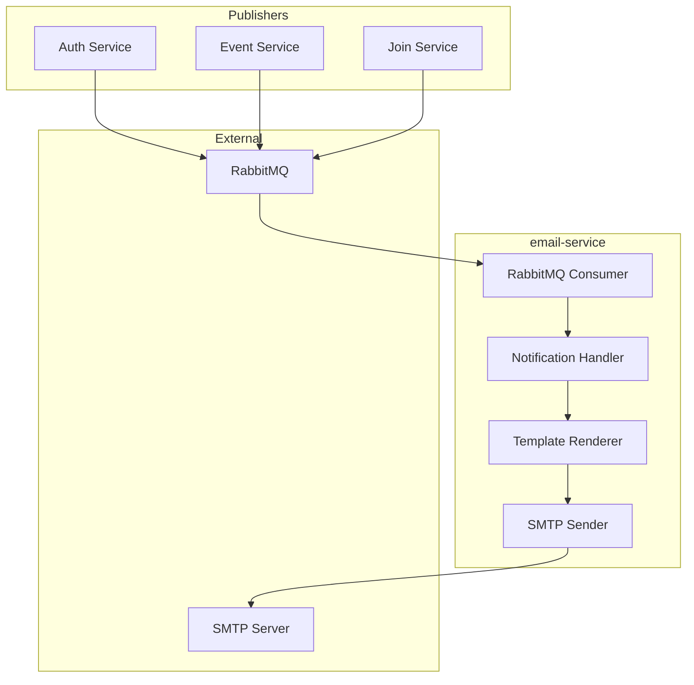
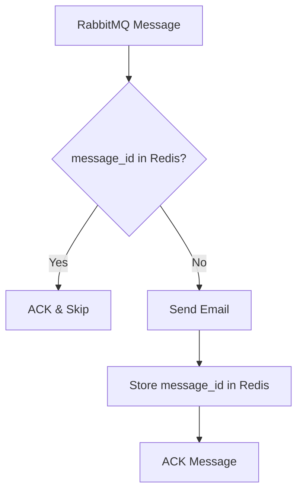

# Email Service Architecture

## Overview

The **email-service** is an asynchronous consumer that handles all outbound email delivery for the platform. It subscribes to RabbitMQ queues and sends transactional emails via SMTP. This decoupled design ensures that upstream services (auth, event, join) are never blocked by email delivery.

## Responsibilities

- **Email Verification** (welcome emails with verification links)
- **Password Reset** (secure reset link delivery)
- **Event Notifications** (join confirmation, waitlist promotion)
- **Moderation Alerts** (account ban/kick notifications)

---

## Architecture Diagram



---

## Key Design Decisions & Tradeoffs

### 1. Event-Driven Consumer (Not HTTP)

**Decision**: Email-service is a pure RabbitMQ consumer with no HTTP API (except health checks).

**Why?**

| Alternative | Problem |
|-------------|---------|
| **HTTP API + sync call** | Upstream blocks waiting for email to send; SMTP can be slow |
| **HTTP API + fire-and-forget** | Still coupling; retry logic duplicated in every caller |
| **MQ consumer** | Decoupled; built-in retry, DLQ; upstream always fast |

### 2. Templated HTML Emails

**Decision**: Use Go `html/template` for email rendering with base layouts.

**Templates**:
```
templates/
├── base.html          # Common header/footer
├── verify_email.html  # Email verification
├── password_reset.html
├── join_confirmed.html
└── waitlist_promoted.html
```

### 3. Dead Letter Queue (DLQ) for Failures

**Decision**: After 3 retries, failed messages move to `email.dlq` for manual inspection.

**Retry Strategy**:
- 1st retry: 1 minute delay
- 2nd retry: 5 minute delay  
- 3rd retry: 30 minute delay
- After 3 failures: Move to DLQ

### 4. Idempotent Processing

**Decision**: Track processed `message_id` in Redis to prevent duplicate emails.

```go
// Check if already processed
if redis.Exists("email:processed:" + msg.MessageID) {
    msg.Ack()
    return
}
// Process, then mark
redis.SetEx("email:processed:" + msg.MessageID, 24*time.Hour, "1")
```

---

## RabbitMQ Configuration

### Consumed Queues

| Queue | Binding Key | Source |
|-------|-------------|--------|
| `email.verify` | `email.verify` | auth-service |
| `email.password_reset` | `email.password_reset` | auth-service |
| `email.join_notifications` | `join.*` | join-service |
| `email.event_notifications` | `event.canceled` | event-service |

### Message Schema

```json
{
  "message_id": "uuid",
  "event_type": "email.verify",
  "payload": {
    "user_id": "uuid",
    "email": "user@example.com",
    "url": "https://app.com/verify?token=xxx"
  },
  "occurred_at": "2024-01-01T00:00:00Z"
}
```

---

## SMTP Configuration

| Environment Variable | Description | Default |
|---------------------|-------------|---------|
| `SMTP_HOST` | SMTP server hostname | `mailpit` (dev) |
| `SMTP_PORT` | SMTP port | `1025` |
| `SMTP_USER` | Authentication username | (optional) |
| `SMTP_PASS` | Authentication password | (optional) |
| `SMTP_FROM` | Sender email address | `noreply@cityevents.app` |
| `SMTP_TLS` | Enable TLS | `true` |

---

## Health & Observability

- **Health endpoint**: `GET /readyz` - checks RabbitMQ and SMTP connectivity
- **Metrics**: Prometheus counters for emails sent, failed, retried
- **Logging**: Structured JSON logs with message_id correlation

---

## Testing Strategy

1. **Unit Tests**: Handler logic with mocked SMTP sender
2. **Integration Tests**: Real RabbitMQ + Mailpit (SMTP catch-all)
3. **Template Tests**: Render templates and validate HTML structure
4. **DLQ Tests**: Simulate SMTP failures, verify retry + DLQ escalation

---

## Distributed Systems Guarantees

### Exactly-Once Email Delivery



**Why Redis for Deduplication?**
- Fast lookup (< 1ms)
- TTL-based cleanup (24h)
- Survives service restart

### Retry Strategy (Exponential Backoff)

| Attempt | Delay | Total Wait |
|---------|-------|------------|
| 1 | Immediate | 0 |
| 2 | 1 min | 1 min |
| 3 | 5 min | 6 min |
| 4 | 30 min | 36 min |
| 5+ | DLQ | — |

**Why Exponential Backoff?**
- Transient SMTP issues often resolve quickly
- Prevents hammering a failing server
- DLQ allows manual intervention for persistent failures

### At-Least-Once Semantics

| Guarantee | Mechanism |
|-----------|-----------|
| No lost messages | RabbitMQ ACK only after successful send |
| No duplicate emails | Redis `message_id` deduplication |
| Order not guaranteed | Emails are independent; order doesn't matter |

### Horizontal Scaling

```yaml
replicas: 2-5
consumers:
  prefetch: 10  # Process 10 messages at a time
```

**Scaling Properties**:
- Stateless (Redis holds dedupe state)
- RabbitMQ work queue distributes load
- SMTP connections pooled per instance

