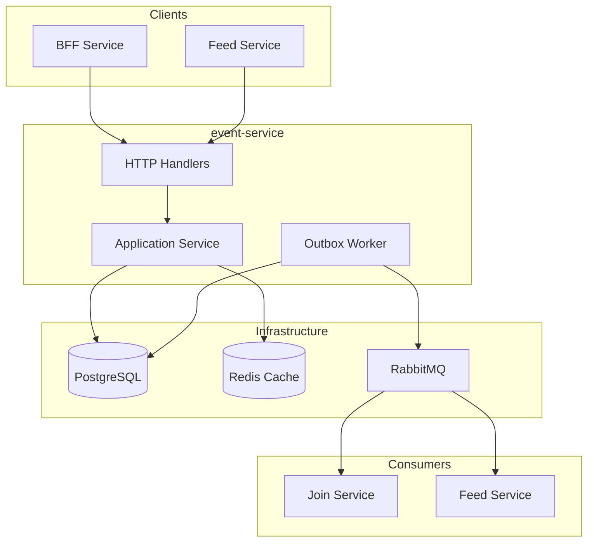
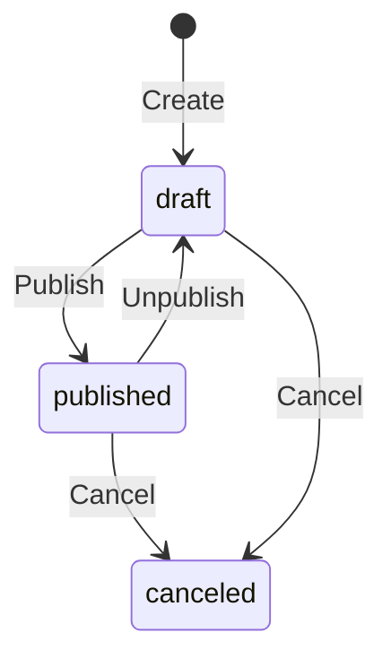
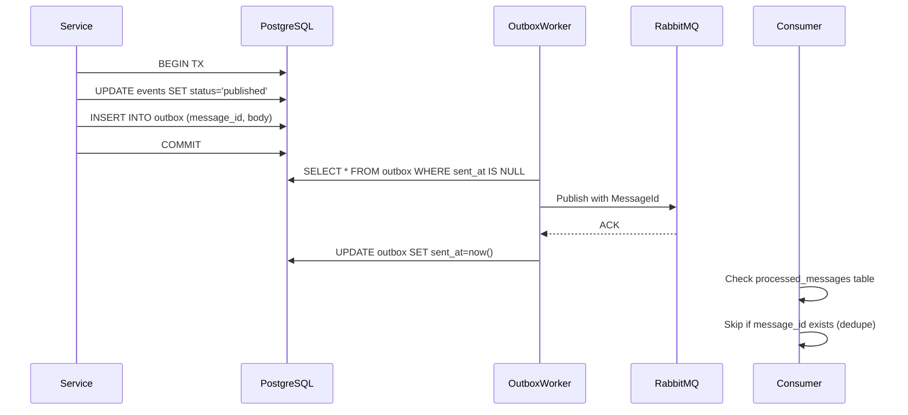

# Event Service Architecture

## Overview

The **event-service** is the core business service managing the event lifecycle, from creation through publication to cancellation. It implements a robust event-driven architecture using the **Transactional Outbox Pattern** for reliable messaging.

## Responsibilities

- **Event CRUD** (create, read, update)
- **Event Lifecycle** (draft → published → canceled)
- **Feed Query Support** (keyset pagination, filtering)
- **Participant Count Tracking** (via RabbitMQ consumption)
- **City Autocomplete** (typeahead suggestions)
- **Cover Image Management** (integration with media-service)

---

## Architecture Diagram



---

## Key Design Decisions & Tradeoffs

### 1. Transactional Outbox Pattern

**Decision**: Events are written to an `event_outbox` table within the same DB transaction as the domain change, then relayed to RabbitMQ by a background worker.

**Why Outbox over Direct Publishing?**

| Alternative | Problem |
|-------------|---------|
| **Direct RabbitMQ publish in handler** | If RabbitMQ is down, the DB commit succeeds but message is lost |
| **Two-phase commit (2PC)** | Complex, slow, not supported by most message brokers |
| **Saga pattern** | Overkill for simple publish; needed for multi-service transactions |

**Benefits**:
- **Exactly-once delivery guarantee** (via `message_id` deduplication)
- **Resilience to broker failures** (retry from outbox)
- **Atomic consistency** (event + message in one transaction)

### 2. Keyset Pagination

**Decision**: Use keyset (cursor-based) pagination instead of OFFSET-LIMIT.

**Why Keyset?**

| Approach | Performance | Consistency |
|----------|-------------|-------------|
| **OFFSET-LIMIT** | O(n) - scans skipped rows | Inconsistent if rows inserted/deleted |
| **Keyset** | O(log n) - index seek | Consistent - uses indexed columns |

**Implementation**:
```sql
-- Time-ordered keyset (for "latest" sort)
WHERE (start_time, id) > ($after_time, $after_id)
ORDER BY start_time ASC, id ASC LIMIT 20

-- Relevance keyset (for "trending" sort with composite score)
WHERE (score, start_time, id) > ($after_score, $after_time, $after_id)
ORDER BY score DESC, start_time ASC, id ASC LIMIT 20
```

### 3. Event Status Lifecycle

**Decision**: Strict state machine with explicit transitions.



**Why explicit states?**
- Prevents invalid transitions (e.g., publish a canceled event)
- Enables optimistic locking via `SELECT FOR UPDATE`
- Clear audit trail for moderation

### 4. Redis Caching Strategy

**Decision**: Cache-aside pattern with short TTL for hot data.

| Cache Key | TTL | Purpose |
|-----------|-----|---------|
| `event:{id}` | 5 min | Single event lookups |
| `feed:public:{city}:{cursor}` | 15 sec | Public feed pages |
| `cities:suggestions` | 1 hour | City autocomplete |

**Cache Invalidation**: On event update/publish/cancel, delete related cache keys.

---

## Database Schema

### PostgreSQL Tables

```sql
CREATE TABLE events (
  id UUID PRIMARY KEY,
  owner_id TEXT NOT NULL,
  title TEXT NOT NULL,
  description TEXT NOT NULL,
  city TEXT NOT NULL,
  city_norm TEXT NOT NULL,  -- Normalized for search (lowercase, trimmed)
  category TEXT NOT NULL,
  start_time TIMESTAMPTZ NOT NULL,
  end_time TIMESTAMPTZ NOT NULL,
  capacity INT DEFAULT 0,   -- 0 = unlimited
  status TEXT NOT NULL,     -- 'draft', 'published', 'canceled'
  active_participants INT DEFAULT 0,
  cover_image_ids JSONB,    -- Array of media-service image IDs
  published_at TIMESTAMPTZ,
  canceled_at TIMESTAMPTZ,
  created_at TIMESTAMPTZ NOT NULL,
  updated_at TIMESTAMPTZ NOT NULL
);

CREATE TABLE event_outbox (
  id BIGSERIAL PRIMARY KEY,
  message_id UUID UNIQUE NOT NULL,  -- Idempotency key for consumers
  routing_key TEXT NOT NULL,
  body JSONB NOT NULL,
  created_at TIMESTAMPTZ DEFAULT now(),
  sent_at TIMESTAMPTZ,              -- NULL until successfully published
  attempts INT DEFAULT 0,
  last_error TEXT
);
```

### Database Optimizations

1. **Composite Indexes for Feed Queries**:
   ```sql
   CREATE INDEX idx_events_status_start ON events(status, start_time);
   CREATE INDEX idx_events_city_start ON events(city, start_time);
   CREATE INDEX idx_events_owner_created ON events(owner_id, created_at DESC);
   ```

2. **Partial Index for Outbox Polling**:
   ```sql
   CREATE INDEX idx_event_outbox_unsent 
     ON event_outbox(id) WHERE sent_at IS NULL;
   ```

3. **GIN Index for Full-Text Search** (optional):
   ```sql
   CREATE INDEX idx_events_search ON events 
     USING GIN(to_tsvector('english', title || ' ' || description));
   ```

---

## RabbitMQ Integration

### Published Events (via Outbox)

| Routing Key | Trigger | Consumers |
|-------------|---------|-----------|
| `event.published` | Publish action | join-service (create capacity), feed-service |
| `event.canceled` | Cancel action | join-service (notify participants) |
| `event.updated` | Update action | feed-service (refresh cache) |

### Consumed Events

| Routing Key | Publisher | Action |
|-------------|-----------|--------|
| `join.confirmed` | join-service | Increment active_participants |
| `join.canceled` | join-service | Decrement active_participants |

**Outbox Worker**: Polls every 1 second, publishes pending messages in batches of 50, marks `sent_at` on success.

---

## API Endpoints

### Public Routes
| Method | Path | Description |
|--------|------|-------------|
| GET | `/event/v1/events` | List public events (cursor pagination) |
| GET | `/event/v1/events/{id}` | Get event details |
| GET | `/event/v1/meta/cities` | City autocomplete suggestions |

### Authenticated Routes
| Method | Path | Description |
|--------|------|-------------|
| POST | `/event/v1/events` | Create event (owner = caller) |
| PATCH | `/event/v1/events/{id}` | Update event (owner only) |
| POST | `/event/v1/events/{id}/publish` | Publish event |
| POST | `/event/v1/events/{id}/unpublish` | Unpublish event |
| POST | `/event/v1/events/{id}/cancel` | Cancel event |
| GET | `/event/v1/me/events` | List my created events |

---

## Testing Strategy

1. **Unit Tests**: Service layer with mocked EventRepo, Cache, Publisher
2. **Integration Tests**: Real PostgreSQL, test outbox worker, verify message_id uniqueness
3. **Concurrency Tests**: Parallel publish/unpublish to verify SELECT FOR UPDATE locking
4. **DLQ Tests**: Simulate RabbitMQ failures, verify outbox retry logic

---

## Performance Considerations

- **Batch outbox publishing**: Reduces RabbitMQ round trips
- **Connection pooling**: pgx pool with 10-20 connections
- **Prepared statements**: Common queries are prepared at startup
- **Read-replica friendly**: Feed queries can target read replicas (future)

---

## Distributed Systems Guarantees

### Exactly-Once Message Delivery (Outbox Pattern)



**Guarantees**:
- ✅ No lost messages (outbox persists until confirmed)
- ✅ No duplicate processing (consumer-side deduplication via `message_id`)
- ✅ Atomic state + message (same DB transaction)

### Cache Invalidation Strategy

| Trigger | Cache Keys Invalidated | Method |
|---------|------------------------|--------|
| Event update | `event:{id}` | Explicit delete |
| Event publish/unpublish | `event:{id}`, `feed:*` | Delete + pattern |
| Join count change | `event:{id}` | TTL-based (15s) |

**Write-Through for Critical Data**:
- Event status changes always invalidate cache
- Feed caches use short TTL (15s) to balance freshness vs. DB load

### State Drift Prevention

| Problem | Solution |
|---------|----------|
| Event published but join-service doesn't know | Outbox guarantees delivery + idempotent handler |
| Participant count mismatch | Reconciliation: join-service is source of truth, events query join count |
| Stale feed cache | Short TTL + explicit invalidation on writes |

### Horizontal Scaling

```yaml
# Auto-scaling triggers
- CPU > 70%: Scale out
- Outbox queue depth > 100: Scale outbox worker
- RabbitMQ consumer prefetch: 10 per instance
```

**Scaling Considerations**:
- Outbox worker: Single leader election OR idempotent multi-worker with row-locking
- API handlers: Stateless, scales linearly
- Read queries: Can target read replicas

