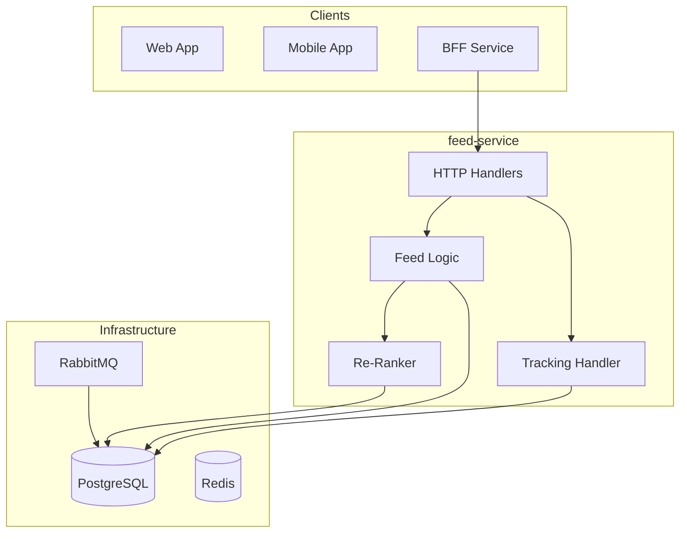
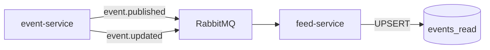

# Feed Service Architecture

## Overview

The **feed-service** powers the recommendation and discovery features, providing personalized and trending event feeds. It implements a lightweight recommender system with real-time behavior tracking and profile-based reranking.

## Responsibilities

- **Trending Feed** (popularity-scored events)
- **Latest Feed** (chronologically ordered)
- **Personalized Feed** (user preference reranking)
- **Behavior Tracking** (views, clicks, joins)
- **Anonymous User Support** (HMAC-signed cookie IDs)
- **Search & Filtering** (city, category, text query)

---

## Architecture Diagram



---

## Key Design Decisions & Tradeoffs

### 1. Scoring Algorithm for Trending

**Decision**: Composite score combining recency and engagement.

```
score = (active_participants ^ 0.8) / ((hours_since_published + 2) ^ 1.5)
```

**Why this formula?**
- **Participant count**: Higher engagement = higher visibility
- **Decay factor**: Older events naturally fall off
- **Constant (2)**: Prevents division-by-zero for brand new events

**Alternative Considered**: Pure ML ranking
- Pros: Better personalization
- Cons: Requires training data, compute overhead, cold-start problem
- Decision: Start simple, add ML layer later if needed

### 2. Three-Tier Feed Strategy

| Feed Type | Sort Order | Use Case |
|-----------|------------|----------|
| **Trending** | Composite score DESC | Homepage discovery |
| **Latest** | start_time ASC | "What's new" section |  
| **Personalized** | Reranked trending | Logged-in users |

**Personalized Flow**:
1. Fetch base trending results
2. Load user profile (category preferences)
3. Apply preference-weighted reranking
4. Inject diversity items (8% random events)

### 3. Anonymous User Tracking

**Decision**: Use HMAC-signed cookies for anonymous actor identification.

**Why?**

| Alternative | Problem |
|-------------|---------|
| **No tracking** | Can't provide personalization to non-logged-in users |
| **IP-based** | Shared IPs, proxies, privacy concerns |
| **Fingerprinting** | Privacy-invasive, blocked by browsers |
| **HMAC cookie** | Persistent, hard to forge, respects privacy |

**Cookie Structure**:
```
anon_id = base64(uuid + ":" + hmac(uuid, secret))
```

### 4. User Profile Building

**Decision**: Maintain per-user category affinity scores based on behavior.

```sql
CREATE TABLE user_profiles (
  actor_key TEXT PRIMARY KEY,  -- user_id or anon_id
  category_weights JSONB,       -- {"Tech": 0.8, "Music": 0.4, ...}
  updated_at TIMESTAMPTZ
);
```

**Behavior → Weight Update**:
| Action | Weight Impact |
|--------|--------------|
| View event | +0.1 to category |
| Join event | +0.5 to category |
| Click through | +0.2 to category |
| Decay | -5% per week |

### 5. Keyset Pagination with Composite Cursor

**Decision**: Encode multiple sort fields in cursor for stable pagination.

**Cursor Structure** (base64-encoded JSON):
```json
{
  "score": 42.5,
  "start_time": "2024-01-15T10:00:00Z",
  "id": "uuid"
}
```

**Why composite cursor?**
- Score alone is not unique (ties)
- start_time + id guarantees uniqueness
- Enables efficient `WHERE (score, start_time, id) > (?, ?, ?)`

---

## Database Schema

### PostgreSQL Tables

```sql
-- Read-optimized event projections (synced from event-service via RabbitMQ)
CREATE TABLE events_read (
  id UUID PRIMARY KEY,
  owner_id TEXT NOT NULL,
  title TEXT NOT NULL,
  description TEXT NOT NULL,
  city TEXT NOT NULL,
  city_norm TEXT NOT NULL,
  category TEXT NOT NULL,
  start_time TIMESTAMPTZ NOT NULL,
  capacity INT,
  active_participants INT DEFAULT 0,
  cover_image_url TEXT,
  score FLOAT8 DEFAULT 0,  -- Precomputed trending score
  published_at TIMESTAMPTZ,
  updated_at TIMESTAMPTZ
);

-- User behavior profiles
CREATE TABLE user_profiles (
  actor_key TEXT PRIMARY KEY,
  category_weights JSONB DEFAULT '{}',
  total_views INT DEFAULT 0,
  total_joins INT DEFAULT 0,
  updated_at TIMESTAMPTZ DEFAULT now()
);

-- Behavior tracking events (append-only log)
CREATE TABLE track_events (
  id BIGSERIAL PRIMARY KEY,
  actor_key TEXT NOT NULL,
  event_id UUID NOT NULL,
  action TEXT NOT NULL,  -- 'view', 'click', 'join'
  created_at TIMESTAMPTZ DEFAULT now()
);
```

### Database Optimizations

```sql
-- Trending feed (score-based pagination)
CREATE INDEX idx_events_read_trending 
  ON events_read(score DESC, start_time ASC, id ASC)
  WHERE published_at IS NOT NULL;

-- City-filtered feed
CREATE INDEX idx_events_read_city_score 
  ON events_read(city_norm, score DESC, id)
  WHERE published_at IS NOT NULL;

-- Latest feed (time-based pagination)
CREATE INDEX idx_events_read_latest 
  ON events_read(start_time ASC, id ASC)
  WHERE published_at IS NOT NULL;

-- Full-text search (optional)
CREATE INDEX idx_events_read_search 
  ON events_read USING GIN(to_tsvector('english', title || ' ' || description));
```

---

## RabbitMQ Integration

### Consumed Events

| Routing Key | Publisher | Action |
|-------------|-----------|--------|
| `event.published` | event-service | Insert into events_read, compute initial score |
| `event.updated` | event-service | Update events_read projection |
| `event.canceled` | event-service | Delete from events_read |
| `join.confirmed` | join-service | Increment active_participants, update score |
| `join.canceled` | join-service | Decrement active_participants, update score |

**Score Refresh**: On each join event, recalculate score using the formula above.

---

## API Endpoints

| Method | Path | Description |
|--------|------|-------------|
| GET | `/api/feed?type=trending` | Trending events (default) |
| GET | `/api/feed?type=latest` | Newest events |
| GET | `/api/feed?type=personalized` | Personalized for user |
| GET | `/api/feed?city=X&category=Y` | Filtered feed |
| GET | `/api/feed?q=search` | Text search |
| POST | `/api/feed/track` | Track user behavior |
| GET | `/api/feed/health` | Health check |

### Query Parameters

| Param | Type | Description |
|-------|------|-------------|
| `type` | string | `trending`, `latest`, `personalized` |
| `city` | string | Filter by city |
| `category` | string | Filter by category |
| `q` | string | Search query |
| `limit` | int | Page size (default 20, max 100) |
| `cursor` | string | Pagination cursor |

---

## Rate Limiting

Two-tier rate limiting to protect against abuse:

| Limiter | Target | Limit |
|---------|--------|-------|
| **Actor Limiter** | user_id/anon_id | 60 req/min |
| **IP Limiter** | IP address | 100 req/min |

---

## Testing Strategy

1. **Unit Tests**: Handler logic, cursor encoding/decoding, reranking algorithm
2. **Integration Tests**: Full feed query with real PostgreSQL
3. **Load Tests**: Verify keyset pagination scalability
4. **Personalization Tests**: Profile update + rerank verification

---

## Distributed Systems Guarantees

### CQRS Read Model Synchronization



**Consistency Model**: Eventually consistent (typically < 1 second lag).

**Guarantees**:
- ✅ No missing events (consumer commits offset after DB write)
- ✅ Idempotent updates (UPSERT with `ON CONFLICT`)
- ✅ Ordered processing (single consumer per partition)

### State Drift Prevention

| Scenario | Prevention |
|----------|------------|
| Event in event-service but not in feed | Outbox pattern ensures delivery |
| Participant count mismatch | Score recalculated on each `join.*` event |
| Stale profile weights | TTL-based decay + background refresh |

**Reconciliation (Optional)**:
```sql
-- Periodic full sync from event-service (disaster recovery)
TRUNCATE events_read;
-- Re-consume all events from a snapshot topic
```

### Cache Strategy

| Layer | TTL | Pattern | Consistency |
|-------|-----|---------|-------------|
| PostgreSQL | ∞ | Source of truth | Strong |
| Feed results | 15s | Cache-aside | Eventual |
| User profiles | 5min | Write-through | Strong for writes |

**No Cache Stampede**:
```go
// Singleflight for concurrent cache miss
result, _ := singleflight.Do(cacheKey, func() (any, error) {
    return repo.GetFeed(...)
})
```

### Horizontal Scaling

```yaml
replicas: 2-10
HPA:
  cpuUtilization: 70%
  customMetrics:
    - rabbitmq_queue_messages > 500
```

**Scaling Properties**:
- Read-heavy (90%+ GET), scales linearly
- RabbitMQ consumers: Work queue pattern (messages distributed across instances)
- PostgreSQL: Read-replica ready for feed queries

