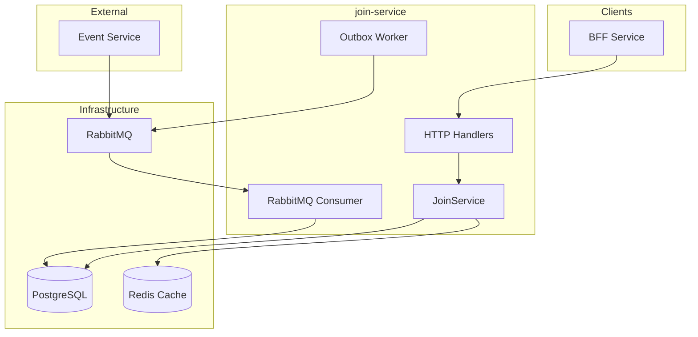
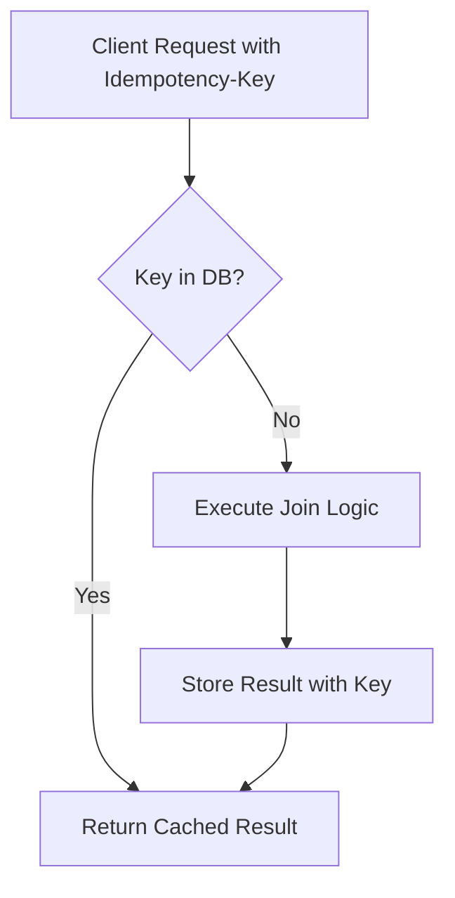

# Join Service Architecture

## Overview

The **join-service** manages event participation (registration), waitlists, and moderation actions. It is designed for **high concurrency** with strong consistency guarantees, using idempotency keys to ensure exactly-once semantics.

## Responsibilities

- **Event Registration** (join with capacity check)
- **Waitlist Management** (FIFO queue promotion)
- **Cancellation Handling** (release spots, promote waitlist)
- **Moderation** (kick, ban, unban participants)
- **Participant Queries** (list participants, waitlist, stats)
- **Cross-Service Sync** (event capacity snapshots from event-service)

---

## Architecture Diagram



---

## Key Design Decisions & Tradeoffs

### 1. Idempotency Keys for Writes

**Decision**: All mutation operations (join, cancel, kick, ban) require an `Idempotency-Key` header.

**Why?**

| Without Idempotency | Problem |
|---------------------|---------|
| **Network retry** | User joins twice if connection drops mid-response |
| **Client retry** | Duplicate registrations consume capacity |
| **Message replay** | Consumer processes same RabbitMQ message twice |

**Implementation**:
```sql
CREATE TABLE idempotency_keys (
  key TEXT PRIMARY KEY,
  result JSONB NOT NULL,
  created_at TIMESTAMPTZ DEFAULT now()
);
-- TTL: 24 hours, cleaned by background job
```

On duplicate key: Return cached result instead of re-executing.

### 2. Event Capacity Snapshots

**Decision**: Store local copy of event capacity in `event_capacity` table, updated via RabbitMQ from event-service.

**Why not call event-service directly?**

| Approach | Tradeoff |
|----------|----------|
| **Sync call to event-service** | Adds latency, coupling, and a single point of failure |
| **Cache in Redis only** | Data loss on restart; no transactional consistency |
| **Local snapshot table** | Eventually consistent, but resilient and fast |

**Flow**:
1. event-service publishes `event.published` with capacity
2. join-service consumer writes to `event_capacity`
3. Join operations read local capacity with `SELECT FOR UPDATE`

### 3. Waitlist with FIFO Promotion

**Decision**: When a participant cancels, the earliest waitlisted user is automatically promoted.

**Implementation**:
```sql
-- Find next in waitlist (FIFO order)
SELECT id, user_id FROM joins
WHERE event_id = $1 AND status = 'waitlisted'
ORDER BY created_at ASC
LIMIT 1 FOR UPDATE SKIP LOCKED;
```

**Why SKIP LOCKED?** Prevents deadlocks when multiple cancellations occur simultaneously.

### 4. Transactional Outbox for Notifications

**Decision**: Use outbox pattern to publish `join.confirmed`, `join.canceled` events.

**Why?**
- Event-service needs to update `active_participants` count
- Email notifications to users on waitlist promotion
- Guaranteed delivery even if RabbitMQ is temporarily down

### 5. Processed Messages Table (Inbox Pattern)

**Decision**: Track consumed message IDs to ensure exactly-once processing.

```sql
CREATE TABLE processed_messages (
  message_id TEXT PRIMARY KEY,
  handler_name TEXT NOT NULL,
  processed_at TIMESTAMPTZ DEFAULT now()
);
```

**Flow**:
1. Check if `message_id` exists
2. If yes, skip (already processed)
3. If no, process and insert `message_id` atomically

---

## Database Schema

### PostgreSQL Tables

```sql
-- Event capacity snapshot (from event-service)
CREATE TABLE event_capacity (
  event_id UUID PRIMARY KEY,
  capacity INT NOT NULL DEFAULT 0,  -- 0 = unlimited
  active_count INT NOT NULL DEFAULT 0,
  waitlist_count INT NOT NULL DEFAULT 0
);

-- Join records
CREATE TYPE join_status AS ENUM ('active', 'waitlisted', 'canceled', 'expired', 'rejected');

CREATE TABLE joins (
  id UUID PRIMARY KEY,
  event_id UUID NOT NULL,
  user_id UUID NOT NULL,
  status join_status NOT NULL,
  created_at TIMESTAMPTZ NOT NULL,
  updated_at TIMESTAMPTZ NOT NULL,
  canceled_at TIMESTAMPTZ,
  activated_at TIMESTAMPTZ,  -- When promoted from waitlist
  UNIQUE(event_id, user_id)  -- One registration per user per event
);

-- Outbox for publishing join events
CREATE TABLE outbox (
  id UUID PRIMARY KEY,
  trace_id TEXT NOT NULL,
  routing_key TEXT NOT NULL,
  payload JSONB NOT NULL,
  status ENUM('pending', 'sent', 'failed'),
  occurred_at TIMESTAMPTZ DEFAULT now(),
  next_retry_at TIMESTAMPTZ
);

-- Moderation
CREATE TABLE event_bans (
  id UUID PRIMARY KEY,
  event_id UUID NOT NULL,
  user_id UUID NOT NULL,
  reason TEXT,
  banned_by UUID NOT NULL,
  expires_at TIMESTAMPTZ,
  created_at TIMESTAMPTZ DEFAULT now(),
  UNIQUE(event_id, user_id)
);
```

### Database Optimizations

```sql
-- FIFO waitlist query
CREATE INDEX idx_joins_waitlist_fifo 
  ON joins(event_id, created_at ASC) 
  WHERE status = 'waitlisted';

-- User history (my joins)
CREATE INDEX idx_joins_user_history 
  ON joins(user_id, created_at DESC);

-- Outbox worker polling
CREATE INDEX idx_outbox_pending 
  ON outbox(next_retry_at) 
  WHERE status = 'pending';
```

---

## RabbitMQ Integration

### Consumed Events

| Routing Key | Publisher | Action |
|-------------|-----------|--------|
| `event.published` | event-service | Create event_capacity record with capacity |
| `event.canceled` | event-service | Set capacity to -1 (blocks new joins) |
| `event.updated` | event-service | Update capacity if changed |

### Published Events (via Outbox)

| Routing Key | Trigger | Consumers |
|-------------|---------|-----------|
| `join.confirmed` | Join success | event-service (increment count), email-service |
| `join.canceled` | Cancellation | event-service (decrement count), email-service |
| `join.waitlisted` | Waitlist add | email-service (notify user) |
| `join.promoted` | Waitlist → Active | email-service (notify user) |
| `mod.kicked` | Kick action | email-service (notify user) |

---

## API Endpoints

### Authenticated Routes
| Method | Path | Description |
|--------|------|-------------|
| POST | `/join/v1/events/{id}/join` | Join event (idempotent) |
| POST | `/join/v1/events/{id}/cancel` | Cancel registration |
| GET | `/join/v1/events/{id}/my` | Get my participation status |
| GET | `/join/v1/me/joins` | List my registrations |

### Organizer/Admin Routes
| Method | Path | Description |
|--------|------|-------------|
| GET | `/join/v1/events/{id}/participants` | List active participants |
| GET | `/join/v1/events/{id}/waitlist` | List waitlisted users |
| GET | `/join/v1/events/{id}/stats` | Get capacity/counts |
| POST | `/join/v1/events/{id}/kick` | Remove participant |
| POST | `/join/v1/events/{id}/ban` | Ban user from event |
| POST | `/join/v1/events/{id}/unban` | Remove ban |

---

## Concurrency Control

1. **SELECT FOR UPDATE**: Lock event_capacity row during join to prevent race conditions
2. **SKIP LOCKED**: Waitlist promotion skips locked rows to avoid deadlocks
3. **Idempotency keys**: Prevent duplicate operations from retries
4. **Unique constraints**: Database-level enforcement of one join per user per event

---

## Testing Strategy

1. **Concurrency Tests**: 100 parallel join requests to verify capacity enforcement
2. **Idempotency Tests**: Duplicate requests return same result
3. **DLQ Tests**: Failed message processing moves to dead-letter queue
4. **Moderation Tests**: Verify organizer-only access to kick/ban

---

## Distributed Systems Guarantees

### Idempotency: Zero Double-Writes



**Guarantees**:
- ✅ Network retry → Same response, no side effects
- ✅ Client retry → Same response, no duplicate join
- ✅ Load balancer retry → Safe, key checked across all instances

### Concurrency Control (No Over-Booking)

```sql
-- Pessimistic locking prevents race condition
BEGIN;
SELECT capacity, active_count FROM event_capacity 
WHERE event_id = $1 FOR UPDATE;

-- Check capacity
IF active_count >= capacity AND capacity > 0 THEN
    -- Add to waitlist instead
END IF;

UPDATE event_capacity SET active_count = active_count + 1;
INSERT INTO joins (...);
COMMIT;
```

**Why FOR UPDATE?**
- 100 concurrent join requests → Only `capacity` succeed
- Row-level lock ensures atomic read-modify-write
- `SKIP LOCKED` for waitlist prevents deadlocks

### State Synchronization (No Drift)

| Source of Truth | Synced Data | Sync Mechanism |
|-----------------|-------------|----------------|
| event-service | Event capacity | RabbitMQ `event.published` → `event_capacity` table |
| join-service | Participant count | RabbitMQ `join.*` → event-service `active_participants` |

**Consistency Model**: Eventually consistent with causal ordering (message_id preserves order).

**Drift Recovery**:
```sql
-- Reconciliation query (run periodically or on-demand)
UPDATE events e SET active_participants = (
    SELECT COUNT(*) FROM joins j 
    WHERE j.event_id = e.id AND j.status = 'active'
);
```

### Retry & Dead Letter Queue

| Failure | Retry Policy | Final State |
|---------|--------------|-------------|
| RabbitMQ consumer error | 3 retries, exponential backoff | Move to DLQ |
| DB transaction failure | Rollback, return 500 | No side effects |
| Outbox publish failure | Infinite retry with backoff | Eventual delivery |

### Horizontal Scaling

```yaml
# Service is stateless, scales horizontally
replicas: 3-10
HPA:
  metrics:
    - cpu: 70%
    - rabbitmq_queue_depth: 1000
```

**Scaling Properties**:
- Redis cache shared across instances
- Idempotency keys in PostgreSQL (shared state)
- RabbitMQ consumers compete for messages (work queue pattern)

