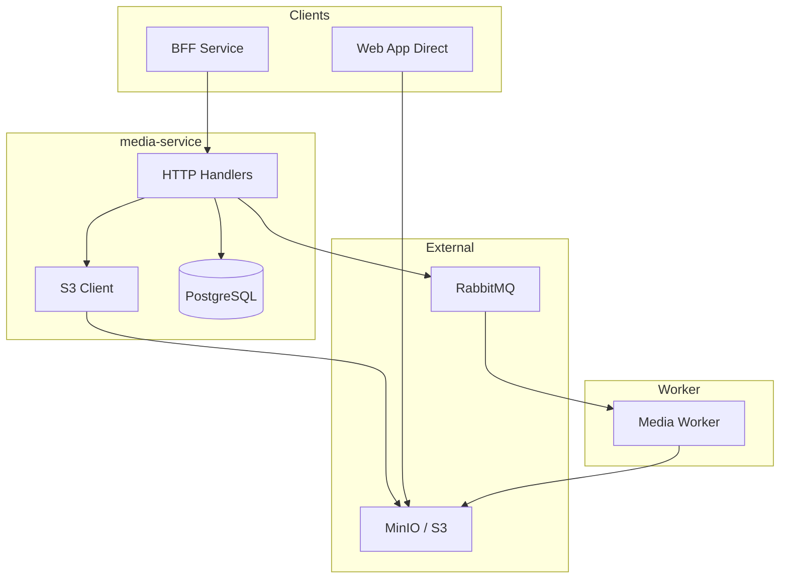

# Media Service Architecture

## Overview

The **media-service** handles image uploads and storage for the platform, providing presigned URL generation for direct S3 uploads and serving processed images via CDN. It works in tandem with media-worker for async image processing.

## Responsibilities

- **Upload URL Generation** (presigned S3 PUT URLs)
- **Upload Completion Tracking** (metadata storage)
- **Image Metadata Management** (dimensions, format, associations)
- **CDN URL Generation** (public access URLs)
- **Job Dispatch** (to media-worker via RabbitMQ)

---

## Architecture Diagram



---

## Key Design Decisions & Tradeoffs

### 1. Client-Side Upload (Presigned URLs)

**Decision**: Clients upload directly to S3 using presigned URLs instead of proxying through the server.

| Alternative | Tradeoff |
|-------------|----------|
| **Server proxy** | Higher bandwidth, increased latency, server bottleneck |
| **Presigned PUT** | Direct upload, reduced server load, requires client-side handling |

**Flow**:
1. Client calls `POST /api/media/request-upload`
2. Server returns presigned PUT URL + upload ID
3. Client uploads directly to S3/MinIO
4. Client calls `POST /api/media/complete` with upload ID
5. Server verifies and dispatches processing job

### 2. Dual Bucket Strategy

**Decision**: Separate buckets for raw uploads and processed public images.

| Bucket | Purpose | Access |
|--------|---------|--------|
| `raw` | Original uploads | Private |
| `public` | Processed images | Public (CDN) |

**Why?**
- Raw images may contain sensitive metadata (EXIF)
- Processing strips metadata, resizes, optimizes
- Public bucket can be behind CDN for caching

### 3. Async Processing via RabbitMQ

**Decision**: Image processing happens in media-worker, not media-service.

**Why?**
- Image processing is CPU-intensive
- Separate worker can be scaled independently
- media-service stays responsive

---

## Database Schema

```sql
CREATE TABLE media (
  id UUID PRIMARY KEY,
  owner_id UUID NOT NULL,        -- User who uploaded
  owner_type TEXT NOT NULL,      -- 'user' or 'event'
  status TEXT NOT NULL,          -- 'pending', 'processing', 'ready', 'failed'
  raw_key TEXT NOT NULL,         -- S3 key in raw bucket
  public_key TEXT,               -- S3 key in public bucket (after processing)
  content_type TEXT,
  size_bytes BIGINT,
  width INT,
  height INT,
  created_at TIMESTAMPTZ DEFAULT now(),
  processed_at TIMESTAMPTZ
);

CREATE INDEX idx_media_owner ON media(owner_type, owner_id);
CREATE INDEX idx_media_status ON media(status) WHERE status = 'pending';
```

---

## API Endpoints

| Method | Path | Description |
|--------|------|-------------|
| POST | `/api/media/request-upload` | Get presigned upload URL |
| POST | `/api/media/complete` | Mark upload complete, trigger processing |
| GET | `/api/media/{id}/status` | Check processing status |
| GET | `/api/media/{id}` | Get media metadata + CDN URL |
| DELETE | `/api/media/{id}` | Delete media (owner only) |

---

## S3 Configuration

| Environment Variable | Description |
|---------------------|-------------|
| `S3_ENDPOINT` | MinIO/S3 endpoint URL |
| `S3_ACCESS_KEY_ID` | Access key |
| `S3_SECRET_ACCESS_KEY` | Secret key |
| `S3_RAW_BUCKET` | Raw uploads bucket name |
| `S3_PUBLIC_BUCKET` | Processed images bucket |
| `CDN_BASE_URL` | Public CDN URL prefix |

---

## RabbitMQ Integration

### Published Events

| Routing Key | Trigger | Consumer |
|-------------|---------|----------|
| `media.process` | Upload complete | media-worker |

### Consumed Events

| Routing Key | Publisher | Action |
|-------------|-----------|--------|
| `media.processed` | media-worker | Update status to 'ready', set public_key |
| `media.failed` | media-worker | Update status to 'failed' |
