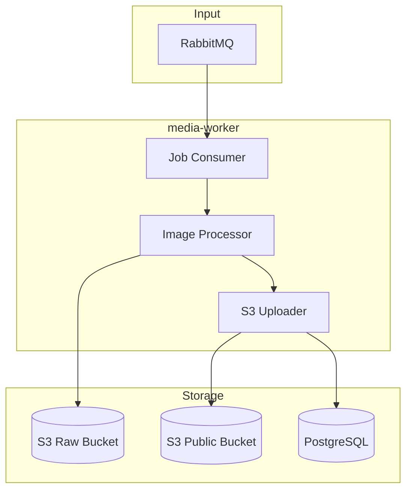

# Media Worker Architecture

## Overview

The **media-worker** is an asynchronous job processor that handles image transformations and optimization. It consumes processing jobs from RabbitMQ, processes images, and uploads results to the public S3 bucket.

## Responsibilities

- **Image Resizing** (thumbnails, standard sizes)
- **Format Conversion** (WebP optimization)
- **Metadata Stripping** (EXIF removal for privacy)
- **Quality Optimization** (compression without visible loss)
- **Multi-Variant Generation** (different sizes for responsive images)

---

## Architecture Diagram



---

## Key Design Decisions & Tradeoffs

### 1. Worker Separation from API

**Decision**: Processing runs in a dedicated worker service, not media-service.

**Why?**
- Image processing is CPU/memory intensive
- API stays responsive for uploads
- Workers can be scaled based on queue depth
- Process isolation (OOM in worker doesn't crash API)

### 2. Image Processing Pipeline

**Variants Generated**:

| Variant | Max Dimension | Format | Use Case |
|---------|---------------|--------|----------|
| `thumbnail` | 150x150 | WebP | List views, avatars |
| `medium` | 600x600 | WebP | Card previews |
| `large` | 1200x1200 | WebP | Detail view |
| `original` | Unchanged | Original | Admin/backup |

### 3. WebP First Strategy

**Decision**: Convert all images to WebP for web delivery.

| Format | Tradeoff |
|--------|----------|
| **JPEG** | Universal support, but larger file size |
| **PNG** | Lossless, very large, good for graphics |
| **WebP** | 25-35% smaller than JPEG, 80%+ browser support |

**Fallback**: Store original format for `original` variant.

### 4. Retry with Dead Letter Queue

**Decision**: Failed jobs retry 3 times, then move to DLQ.

**Retry Delays**:
- 1st: 30 seconds
- 2nd: 2 minutes  
- 3rd: 10 minutes
- After: Move to `media.dlq`

---

## Processing Flow

1. **Consume** job from `media.process` queue
2. **Download** raw image from S3 raw bucket
3. **Validate** image (format, size, dimensions)
4. **Process** each variant:
   - Resize to max dimensions (maintain aspect ratio)
   - Strip EXIF metadata
   - Convert to WebP (if applicable)
   - Optimize quality
5. **Upload** variants to public bucket
6. **Update** database with public keys
7. **Publish** `media.processed` event
8. **Acknowledge** RabbitMQ message

---

## S3 Key Structure

```
raw/
  {media_id}/original.{ext}

public/
  {media_id}/
    thumbnail.webp
    medium.webp
    large.webp
    original.{ext}
```

---

## Configuration

| Environment Variable | Description |
|---------------------|-------------|
| `RABBIT_URL` | RabbitMQ connection string |
| `DATABASE_URL` | PostgreSQL connection string |
| `S3_ENDPOINT` | MinIO/S3 endpoint |
| `S3_RAW_BUCKET` | Source bucket for raw uploads |
| `S3_PUBLIC_BUCKET` | Destination bucket for processed images |
| `WORKER_CONCURRENCY` | Number of parallel processors (default: 4) |

---

## RabbitMQ Configuration

### Consumed Queue

| Queue | Binding Key | DLQ |
|-------|-------------|-----|
| `media.process` | `media.process` | `media.dlq` |

### Published Events

| Routing Key | Trigger | Consumer |
|-------------|---------|----------|
| `media.processed` | Success | media-service |
| `media.failed` | Failure | media-service |

---

## Observability

- **Metrics**: Processing time histogram, success/failure counts per variant
- **Logging**: Structured JSON with media_id, job_id correlation
- **Health**: `/healthz` endpoint (checks RabbitMQ + S3 connectivity)

---

## Error Handling

| Error Type | Action |
|------------|--------|
| **Download failure** | Retry (transient S3 issue) |
| **Invalid image** | Fail immediately (no retry) |
| **Processing failure** | Retry (memory pressure) |
| **Upload failure** | Retry (transient S3 issue) |
| **Max retries exceeded** | Move to DLQ, publish `media.failed` |
